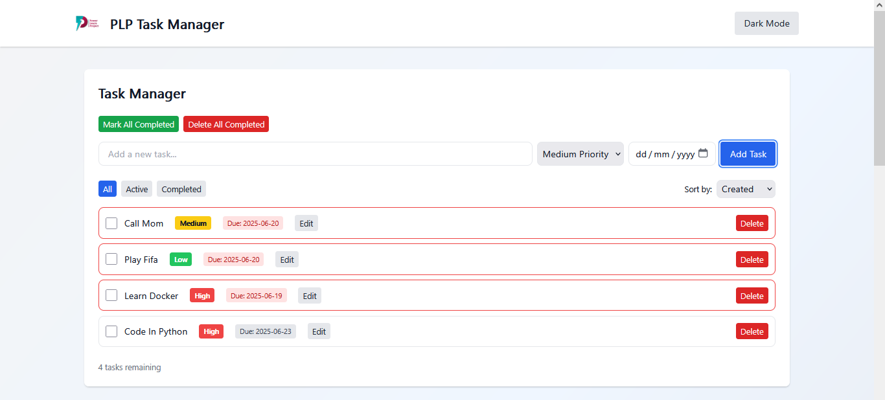

[](https://classroom.github.com/online_ide?assignment_repo_id=19734715&assignment_repo_type=AssignmentRepo)
# 🚀 PLP Task Manager

A modern, professional, and fully responsive React + Vite + Tailwind CSS application for managing tasks and browsing live tech/AI news. Built with best practices, beautiful UI/UX, and ready for deployment.

[](https://your-live-link.netlify.app)

**Live Demo:** [https://your-live-link.netlify.app](https://your-live-link.netlify.app)

---

## ✨ Features
- Add, edit, complete, and delete tasks with priorities and due dates
- Bulk actions: mark all as completed, delete all completed
- Persistent storage with localStorage
- Fetch and search live tech/AI news (with loading, error, and empty states)
- Pagination, search, and beautiful card/grid layouts
- Animated transitions, toasts, confirmation dialogs, and scroll-to-top
- Fully responsive, dark/light mode, and accessible
- Custom scrollbars, focus rings, and global feedback

## 🛠️ Getting Started

1. **Clone the repo:**
   ```bash
   git clone https://github.com/your-username/your-repo.git
   cd your-repo
   ```
2. **Install dependencies:**
   ```bash
   npm install
   ```
3. **Run locally:**
   ```bash
   npm run dev
   ```
4. **Build for production:**
   ```bash
   npm run build
   ```
5. **Preview production build:**
   ```bash
   npm run preview
   ```

## 🌐 Deployment (Netlify)
- Build command: `npm run build`
- Publish directory: `dist`
- For SPA routing, add a `_redirects` file to `public/` or `dist/` with:
  ```
  /*    /index.html   200
  ```
- Drag and drop the `dist` folder to Netlify, or connect your GitHub repo.

## 📁 Project Structure
```
src/
  components/    # Reusable UI components
  pages/         # Page components
  api/           # API integration
  context/       # Theme context
  utils/         # Utility functions
  assets/        # Static assets (logo, images)
  App.jsx        # Main app
  main.jsx       # Entry point
```

## 📸 Screenshots



## 📚 Tech Stack
- [React](https://react.dev/)
- [Vite](https://vitejs.dev/)
- [Tailwind CSS](https://tailwindcss.com/)
- [Netlify](https://netlify.com/)

## 🧑‍💻 Author
- [Your Name](https://github.com/Scylla8434)
